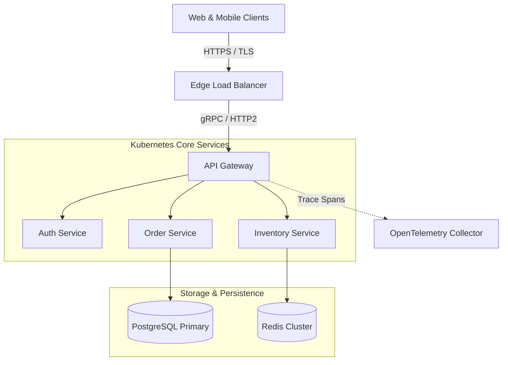
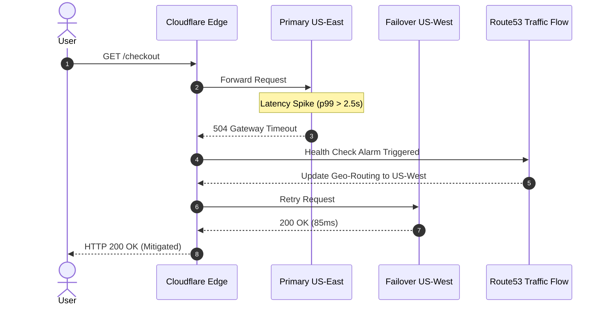
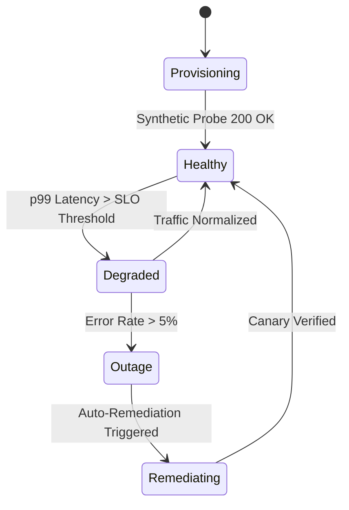

# `mdee` Terminal Viewer: Comprehensive Validation Suite

Welcome to the **`mdee`** test suite! This document is designed to thoroughly exercise all features of the terminal Markdown viewer across modern terminal emulators (**Kitty**, **Ghostty**, **WezTerm**, **iTerm2**, **Foot**, etc.), validating:

1. **Table alignment, width calculations, and word wrapping**
2. **Multi-protocol inline graphics (Kitty, iTerm2 OSC 1337, Sixel) and fallback modes**
3. **Syntax highlighting in multiple programming languages**
4. **Interactive terminal features (OSC 8 hyperlinks, pager, themes)**
5. **Native Mermaid diagram rendering (graphical, Unicode ANSI, and pure ASCII)**

---

## 1. Table Layout & Alignment Verification

This section tests column alignment (`:---` Left, `:---:` Center, `---:` Right), numeric formatting, status emojis, and inline code formatting.

### 1.1 Microservice SLA Matrix (Alignment & Badges)

| Service Name | Cluster ID | Health | Uptime SLA | p50 Latency | p99 Latency | Error Rate |
| :--- | :---: | :---: | :---: | ---: | ---: | ---: |
| `api-gateway` | `us-east-1a` | ✅ Healthy | 99.99% | 1.2ms | 3.4ms | 0.001% |
| `auth-service` | `us-east-1b` | ✅ Healthy | 99.95% | 8.5ms | 18.2ms | 0.012% |
| `payment-processor` | `us-west-2a` | ⚠️ Degraded | 99.99% | 45.0ms | 182.4ms | 0.350% |
| `search-indexing` | `eu-west-1c` | 🛑 Paused | 99.90% | 210.0ms | 940.0ms | 2.100% |
| `cache-redis-l1` | `us-east-1a` | 🚀 Optimal | 99.999% | 0.2ms | 0.7ms | 0.000% |

> **Verification Check**:
> - Confirm the **Health** column is centered and emojis align vertically.
> - Confirm **p50 Latency**, **p99 Latency**, and **Error Rate** columns are right-aligned.
> - Borders should be completely straight with no jagged edges.

---

### 1.2 Unicode & Multi-Byte Character Table (Visual Width Accuracy)

Terminal renderers frequently break on wide characters (East Asian Width / CJK and emojis). This table verifies that Unicode grapheme cluster visual calculation prevents border misalignment:

| Region | Regional Hub | Native Name | Observability Status | Telemetry Notes |
| :--- | :--- | :--- | :---: | :--- |
| `ap-northeast-1` | Tokyo | 東京 (とうきょう) | 🟢 正常 | Subsea fiber redundant links verified |
| `ap-northeast-2` | Seoul | 서울 (Seoul) | 🟢 正常 | Edge CDN cache hit ratio > 94% |
| `ap-southeast-1` | Singapore | 新加坡 / Singapura | 🟡 警告 | High peering ingress during peak hour |
| `cn-north-1` | Beijing | 北京 (Běijīng) | 🟢 正常 | Cross-border MPLS link stable |

---

### 1.3 Responsive Column Word-Wrapping (Terminal Constrained)

When terminal columns are restricted or content is long, the table engine must proportionally wrap text at word boundaries without clipping:

| Component | Responsibility & Architecture | Failure Modes & Risk | Mitigation Runbook |
| :--- | :--- | :--- | :--- |
| **Ingress Controller** | Terminates external TLS connections and directs HTTP traffic across internal Kubernetes service pods. | High connection concurrency causing epoll thread pool starvation and dropped SYN packets. | Scale horizontal replicas and tune `net.core.somaxconn` and worker connections. |
| **Distributed Consensus** | Raft-based distributed key-value storage maintaining cluster configuration state and leader elections. | Split-brain partition during network transit degradation between availability zones. | Ensure odd quorum voting nodes and verify heartbeat election timeouts. |
| **Time-Series Engine** | High-throughput metrics ingestion pipeline storing Prometheus metrics and alerting telemetry. | Disk IOPS saturation during high-cardinality metric spikes causing ingest backpressure. | Enable write-ahead log compression and drop high-cardinality label dimensions. |

> **Verification Check**:
> - Run with `-w 80` (`./bin/mdee -w 80 test.md`).
> - Notice how each cell wraps cleanly on word boundaries while maintaining row separation!

---

## 2. Multi-Protocol Inline Image Rendering (Kitty, iTerm2, Sixel)

### 2.1 Local Relative Image

The image below is resolved relative to this Markdown file (`testdata/sample.png`):


*Figure 1: Telemetry bar chart rendered directly into the terminal window via Kitty APC, iTerm2 OSC 1337, or DEC Sixel.*

### 2.2 Remote Image Streaming

The image below is fetched over HTTPS with bounded timeout and safety limit checks:


### 2.3 Non-Existent Image Fallback Test

This tests graceful degradation when an image source cannot be resolved:


### 2.4 HTML Image Tags (``)

Images referenced using HTML `` tags (including relative file paths and web URLs, with container wrappers such as `<p align="center">`, `<div>`, or `<a>`) are parsed and rendered inline:

<p align="center">
  
</p>

Inline HTML images within sentences are also supported:  seamlessly embedded.

> **Verification Check**:
> - In compatible terminals (**Kitty**, **Ghostty**, **WezTerm**, **iTerm2**, **Foot**), Figure 1 and the HTML images above should display as inline graphics.
> - The missing asset above should render an elegant warning box rather than aborting or crashing.
> - Run with `--images=never` or `--image-protocol=none` to view ASCII/Unicode placeholder cards for all images.
> - Test protocol overrides: `--image-protocol kitty`, `--image-protocol iterm2`, `--image-protocol sixel`.

---

## 3. Syntax Highlighting Across Languages

### Go

```go
package main

import (
	"context"
	"fmt"
	"time"
)

// SREHealthCheck validates endpoint responsiveness
func SREHealthCheck(ctx context.Context, endpoint string) error {
	ctx, cancel := context.WithTimeout(ctx, 2*time.Second)
	defer cancel()

	fmt.Printf("[HEALTH] Checking %s\n", endpoint)
	return nil
}
```

### Python

```python
import sys
import time
from dataclasses import dataclass

@dataclass
class MetricAlert:
    name: str
    threshold: float
    current_value: float

    def is_firing(self) -> bool:
        return self.current_value >= self.threshold

alert = MetricAlert(name="DiskSpaceCritical", threshold=90.0, current_value=93.4)
if alert.is_firing():
    print(f"CRITICAL: {alert.name} firing at {alert.current_value}%", file=sys.stderr)
```

### Bash

```bash
#!/usr/bin/env bash
set -euo pipefail

TARGET_HOST="${1:-localhost}"
echo "[$(date -u +'%Y-%m-%dT%H:%M:%SZ')] Probing ${TARGET_HOST}..."

curl -sSf -m 5 -o /dev/null -w "HTTP %{http_code} | Total: %{time_total}s\n" \
  "https://${TARGET_HOST}/healthz"
```

### JSON

```json
{
  "incident_id": "INC-2026-0913",
  "severity": "SEV-1",
  "responders": ["alice@example.com", "bob@example.com"],
  "metrics": {
    "latency_p99_ms": 284.1,
    "error_rate_pct": 3.42,
    "affected_tenants": 14
  },
  "mitigated": true
}
```

---

## 4. Lists & Task Checkboxes

### Ordered List (Incident Lifecycle)
1. **Detection**: Automated SLO alert triggers on elevated p99 latency.
2. **Triage**: Incident commander establishes war room and diagnostic bridge.
3. **Mitigation**: Traffic routed away from degraded availability zone.
4. **Resolution**: Root cause isolated, patched, and canary verified.
5. **Post-Mortem**: Action items tracked to prevent recurrence.

### Nested Unordered List (SRE Golden Signals)
- **Latency**
  - p50 (Median user experience)
  - p95 (Tail latency threshold)
  - p99 (Critical boundary)
- **Traffic**
  - HTTP Requests per second
  - gRPC Streams
- **Errors**
  - 5xx Server errors
  - Dropped TCP connections
- **Saturation**
  - CPU & Memory utilization
  - Storage IOPS & Epoll connection pools

### Interactive Task Checklists
- [x] Configure automated alerting thresholds for synthetic monitors
- [x] Implement graceful connection draining on SIGTERM
- [x] Verify iTerm2 inline graphics rendering (OSC 1337)
- [x] Verify table border alignment with East Asian and Emoji characters
- [ ] Run load testing drill on staging cluster next sprint
- [ ] Schedule quarterly disaster recovery failover drill

---

## 5. Blockquotes & Callouts

> **SRE Philosophy**: Hope is not a strategy. Engineering resilience requires proactive chaos testing, disciplined observability, and defense in depth.
>
> *— Site Reliability Engineering Best Practices*

---

## 6. Clickable Terminal Hyperlinks (OSC 8)

In modern terminals (including iTerm2), the links below are clickable with `Cmd + Click`:

- [Official Go Language Documentation](https://go.dev)
- [iTerm2 Feature Overview](https://iterm2.com)
- [Google SRE Book Online](https://sre.google/sre-book/table-of-contents/)
- [Project Repository on GitHub](https://github.com/smford/mdee)

---

## 7. Native Mermaid Diagrams (Inline Graphics & Text Fallback)

`mdee` embeds `golang-mermaid` to render Mermaid diagrams directly inside the terminal graphically using native graphics protocols (iTerm2 OSC 1337, Kitty APC, and DEC Sixel). When running in terminals that do not support graphics protocols, when output is piped or redirected, or when explicitly requested via CLI flags, it automatically degrades to clean Unicode box-drawing or pure 7-bit ASCII text diagrams.

### 7.1 Microservice Architecture Topology (Flowchart)



### 7.2 Incident Response & Failover Sequence



### 7.3 Service Health State Machine



---

## 8. Interactive CLI Test Matrix

Run these commands in your terminal to verify various viewer capabilities:

```bash
# 1. Run terminal capabilities diagnostic (including Mermaid engine)
./bin/mdee doctor

# 2. View in default dark theme (graphical Mermaid in iTerm2 / Kitty)
./bin/mdee test.md

# 3. Render Mermaid diagrams as ANSI / Unicode box-drawing text art
./bin/mdee --mermaid ansi test.md

# 4. Render Mermaid diagrams as pure 7-bit ASCII diagrams
./bin/mdee --mermaid ascii test.md

# 5. Display raw syntax-highlighted Mermaid source code blocks
./bin/mdee --mermaid raw test.md

# 6. Render Mermaid image with custom width and high-contrast background canvas
./bin/mdee --mermaid-width 80 --mermaid-bg "#1e1e2e" test.md

# 7. Render Mermaid image with crisp white canvas card
./bin/mdee --mermaid-bg white test.md

# 8. View with Dracula theme and double borders
./bin/mdee --theme dracula --table-style double test.md

# 9. View with Light theme and box borders
./bin/mdee --theme light --table-style box test.md

# 10. Constrain width to 90 columns with line numbers
./bin/mdee -w 90 -n test.md

# 11. Plain text mode (safe for piping / grep / awk, ASCII diagrams)
./bin/mdee --plain test.md | grep "Healthy"

# 12. Test broken pipe handling
cat test.md | ./bin/mdee --plain | head -n 25

# 13. Test configuration file loading and custom flag overrides
./bin/mdee -c .mdeerc.example test.md
./bin/mdee -c .mdeerc.example --theme monokai test.md

# 14. Run terminal diagnostics showing config file status
./bin/mdee doctor
./bin/mdee doctor --config .mdeerc.example

# 15. Preview default ~/.mdeerc configuration template
./bin/mdee init --stdout

# 16. Generate default configuration file to custom path
./bin/mdee init --output /tmp/.mdeerc.test --force

# 17. Test explicit image protocol overrides
./bin/mdee --images always --image-protocol kitty test.md
./bin/mdee --images always --image-protocol iterm2 test.md
./bin/mdee --images always --image-protocol sixel test.md
./bin/mdee --images always --image-protocol none test.md
```
