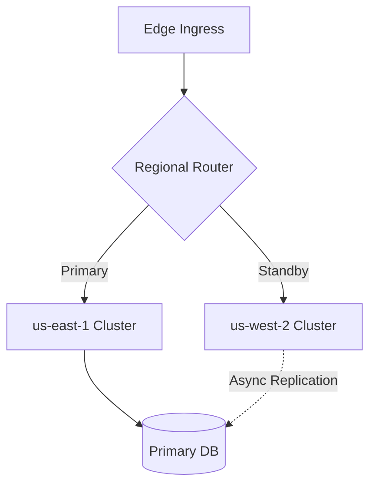

# Production SRE Incident & Architecture Review

> **Incident Summary**: At 14:22 UTC, the automated canary detector flagged a\
> 3.4% error rate increase in the primary API gateway. SRE mitigation procedures\
> were triggered immediately.

---

## Service Health & SLA Status

The table below details current status, SLA targets, and observed p99 latencies:

| Service Name | Health Status | SLA Target | Observed p99 | Failover Region |
| :--- | :---: | :---: | ---: | :--- |
| **api-gateway** | ✅ Normal | `99.99%` | 2.4ms | `us-east-1` (Primary) |
| **auth-service** | ✅ Normal | `99.95%` | 14.8ms | `us-west-2` (Active) |
| **payments-db** | ⚠️ Elevated | `99.99%` | 145.2ms | Multi-region replica sync pending |
| **search-indexer** | 🛑 Paused | `99.90%` | 890.0ms | Worker pool draining gracefully |

---

## Infrastructure Architecture Diagram

Below is the verified architecture diagram rendered directly in iTerm2:


### High-Availability Failover Topology



---

## SRE Runbook Automation

Automated health checks can be executed via the following command:

```bash
# Verify gateway connectivity and response headers
curl -sSL -D - "https://api.example.com/v1/healthz" \
  -H "X-Trace-Id: 8a88e1b8-c981-44c7" \
  -o /dev/null | grep -E "HTTP/|x-response-time"
```

Core health-checking implementation:

```go
package main

import (
	"context"
	"fmt"
	"time"
)

type HealthChecker struct {
	Timeout time.Duration
}

func (h *HealthChecker) Check(ctx context.Context, target string) (bool, error) {
	ctx, cancel := context.WithTimeout(ctx, h.Timeout)
	defer cancel()

	fmt.Printf("[SRE] Probing endpoint: %s\n", target)
	return true, nil
}
```

---

## Action Items & Next Steps

### Immediate Follow-ups
- [x] Drain and rotate affected instances in availability zone `eu-west-1a`
- [x] Revert database migration `20260913_reindex_orders.sql`
- [ ] Implement rate limiter circuit-breaker for unauthenticated traffic
- [ ] Update Prometheus alerting rule `HighP99LatencyWarning` threshold

### References & Dashboards
- [Grafana Cluster Overview](https://grafana.internal/d/sre-prod-overview)
- [PagerDuty Incident Timeline](https://pagerduty.com/incidents/Q892LMA)
- [Post-Mortem Documentation](https://github.com/smford/mdee)
